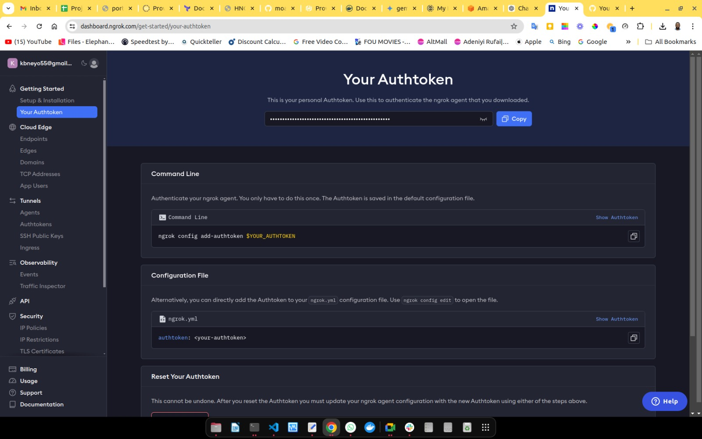
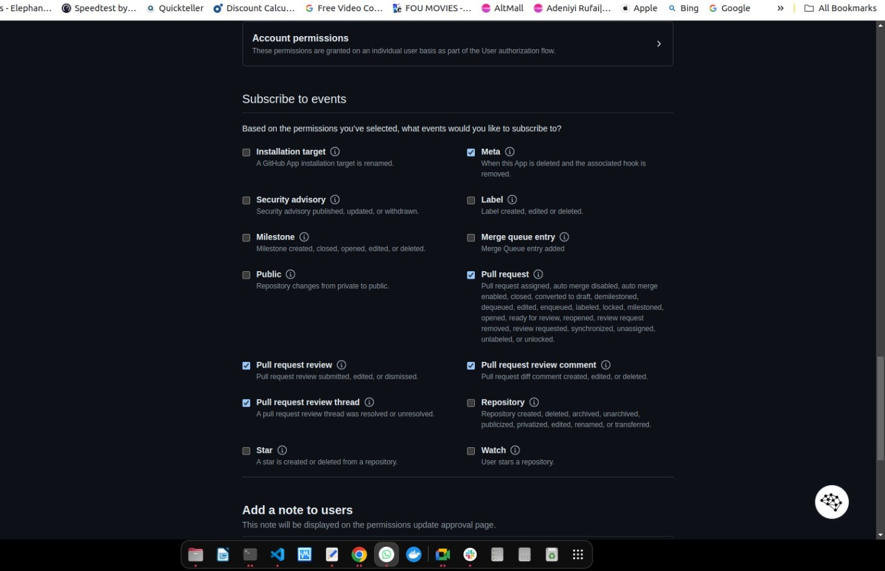
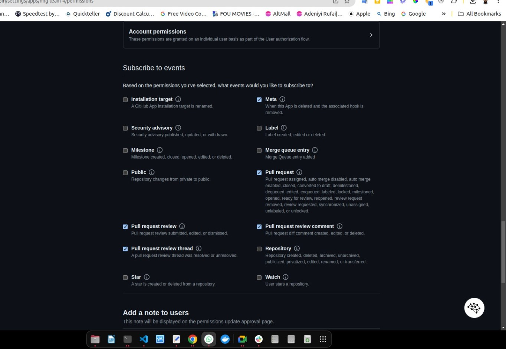
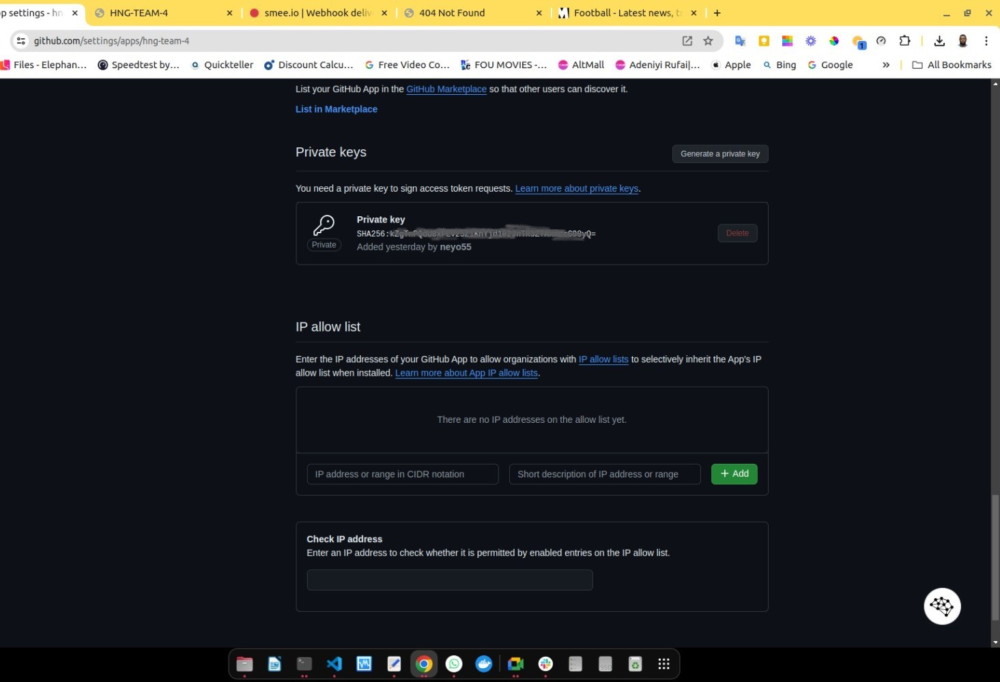

# Documentation for GitHub Bot Repository

### Overview:
This repository contains the code for the GitHub bot that interacts with pull requests (PRs). The bot provides real-time deployment status updates, including links to the deployed environments. It also cleans up containers and resources associated with closed PRs.

- **app.py**: Main bot code.
- **cleanup.sh**: Event handlers for containers clean up.
- **deploy.sh**: Event handlers for deployment and PR events.
- **requirements.txt**: List of Python dependencies.

### Prerequisites:
- Python 3.8 or higher installed.
- GitHub account with admin access to the repository.

### Step-by-Step Guide
---
**PHASE 1**

#### Installing and Running ngrok

#### Step 1: Download ngrok

  - **Download the ngrok Archive**:
    - Use `wget` to download the ngrok archive for Linux:

        ```bash
        wget https://bin.equinox.io/c/4VmDzA7iaHb/ngrok-stable-linux-amd64.zip
        ```

#### Step 2: Install ngrok

 - **Unzip the Downloaded Archive**:
   - Use `unzip` to extract the ngrok binary:

     ```bash
     unzip ngrok-stable-linux-amd64.zip
     ```

 - **Move ngrok to a Directory in Your PATH**:
   - Move the `ngrok` binary to `/usr/local/bin` or another directory in your PATH:

     ```bash
     sudo mv ngrok /usr/local/bin
     ```

#### Step 3: Configure ngrok

 - **Authenticate Your ngrok Account**:
   - Sign up for an ngrok account at [ngrok.com](https://ngrok.com/).
   - Once logged in, find your authentication token on the dashboard.
     
   
   - Run the following command to authenticate your ngrok client:

     ```bash
     ngrok authtoken <your_ngrok_auth_token>
     ```

   - Replace `<your_ngrok_auth_token>` with the token you copied from the ngrok dashboard.

#### Step 4: Start ngrok

 - **Run ngrok to Expose Your Local Server**:
   - Start ngrok to expose your server (running on IP `91.229.239.118` and port `5000`):

     ```bash
     ngrok http 91.229.239.118:5000
     ```

   - This command will create a secure tunnel to your server and provide a public URL.

 - **Copy the Forwarding URL**:
   - After running the above command, you will see output similar to this:

     ```plaintext
     ngrok by @inconshreveable
     (Ctrl+C to quit)

     Session Status                online
     Account                       Your Name (Plan: Free)
     Version                       2.3.40
     Region                        United States (us)
     Web Interface                 http://127.0.0.1:4040
     Forwarding                    https://9684-91-229-239-118.ngrok-free.app -> http://91.229.239.118:5000

     Connections                   ttl     opn     rt1     rt5     p50     p90
                                   0       0       0.00    0.00    0.00    0.00
     ```

     - Copy the `Forwarding` URL (e.g., `https://9684-91-229-239-118.ngrok-free.app`).


### To run ngrok in the background or in `non-interactive` mode.

#### Using `screen`:

`screen` is a terminal multiplexer tool that allow you to run commands in a virtual terminal that can be detached and run in the background.

- Install `screen` (if not already installed):
   ```sh
   sudo apt-get install screen
   ```

- Start a new screen session and run ngrok:
   ```sh
   screen -S ngrok-session
   ```
   ```sh
   ngrok http 91.229.239.118:5000
   ```

- Detach from the screen session by pressing `Ctrl + A` then `D`.

- To reattach to the screen session, use:
   ```sh
   screen -r ngrok-session
   ```
---
**PHASE 2**

#### Step 1: Create a GitHub App

- **Log in to GitHub**:
   - Go to [GitHub](https://github.com/) and log in with your credentials.

- **Navigate to Developer Settings**:
   - Click on your profile picture in the upper-right corner.
   - Select **Settings** from the dropdown menu.
   - Scroll down and find **Developer settings** in the left sidebar.
   - Click on **GitHub Apps** under **Developer settings**.

- **Create a New GitHub App**:
   - Click on the **New GitHub App** button.
   - Fill in the required fields:
     - **GitHub App name**: Choose a name for your app. (hng-team-4)
     - **Homepage URL**: Enter your homepage URL (or any valid URL). (https://github.com/neyo55/hng-team-4-github-bot)
     - **Callback URL**: Enter the callback URL (it can be any valid URL for now).
     - **Webhook URL**: Enter the URL or ngrok endpoint where you want to receive webhook events (e.g., `http://your-server.com/webhook`). (https://9684-91-229-239-118.ngrok-free.app/webhook)
     - **Webhook secret**: Generate a secret and save it for later use in your `.env` file.
   - **Permissions & Events**:
     - Under **Permissions**, set the required permissions for your app. For this bot, you will need:
       - **Contents**: Read & write
       - **Pull requests**: Read & write
         
         
     - Under **Subscribe to events**, select the **Pull request** event.
       

   - **Where can this GitHub App be installed?**: Choose **Only on this account** if you want it limited to your repositories. in our case it was installed in the docker app repository. **(neyo55/hng-team-4-docker-app)**

- **Create the App**:
   - Click on the **Create GitHub App** button at the bottom.

#### Step 2: Generate a Private Key

- **Generate a Private Key**:
   - After creating the app, you'll be taken to the app's settings page.
   - Scroll down to the **Private keys** section.
   - Click on **Generate a private key**.
   - Download the generated `.pem` file and save it as `private-key.pem` in the `hng-team-4-github-bot` directory.
     

#### Step 3: Install the GitHub App

- **Install the App**:
   - On the same settings page, click on **Install App** on the right side.
   - Choose the account or organization where you want to install the app.
   - Select the repository you want the app to have access to and click **Install**.

#### Step 4: Configure the Bot Application

- **Set Up Environment Variables**:
   - Create a `.env` file in the `hng-team-4-github-bot` directory with the following content:

     ```dotenv
     WEBHOOK_SECRET=<your_github_webhook_secret>
     APP_ID=<your_github_app_id>
     PRIVATE_KEY_PATH=private-key.pem
     ```

   - Replace `<your_github_webhook_secret>` with the webhook secret you generated.
   - Replace `<your_github_app_id>` with the GitHub App ID found on your app's settings page.

- **Install Required Python Packages**:
   - Run the following command to install the required packages:
     ```bash
     pip install -r requirements.txt
     ```

- **Run the Flask Application**:
   - Start the Flask application with:
     ```bash
     python app.py
     ```

#### Step 5: Test the Bot Application

- **Open a Pull Request**:
   - Create a new pull request on the repository where the app is installed or any of the contributors can create a new pull request.
   - The bot application would trigger the deployment process.

- **Close a Pull Request**:
   - Close the pull request to trigger the cleanup process.


---
**PHASE 3** 

#### HNG-TEAM-4 GitHub Bot

This project demonstrates a GitHub bot built using Flask. The bot automates deployment and cleanup of Docker containers for pull requests. The repository contains the necessary scripts and configuration files to set up and run the bot.

Please note that this readme is written based on running the flask application on the server and not on local environment as there is going to be a tweaks oe changes on the application files (app.py, deploy.sh and cleanup.sh).

**Project Structure**

```plaintext
.
├── app.py
├── deploy.sh
├── cleanup.sh
├── private-key.pem
├── requirements.txt
└── .env
```

**`app.py`**

- This is the main application script that handles GitHub webhook events for pull requests and triggers deployment and cleanup scripts.

    ```python
    from flask import Flask, request, jsonify
    import subprocess
    import requests
    import re
    import jwt
    import time
    import os
    import hmac
    import hashlib
    from cryptography.hazmat.primitives import serialization
    from cryptography.hazmat.backends import default_backend
    from dotenv import load_dotenv

    # Load environment variables from .env file
    load_dotenv()

    app = Flask(__name__)

    # Load configuration from environment variables
    WEBHOOK_SECRET = os.getenv('WEBHOOK_SECRET')
    APP_ID = os.getenv('APP_ID')
    PRIVATE_KEY_PATH = os.getenv('PRIVATE_KEY_PATH')

    # Load the private key
    with open(PRIVATE_KEY_PATH, 'r') as key_file:
        private_key = serialization.load_pem_private_key(
            key_file.read().encode(),
            password=None,
            backend=default_backend()
        )

    def verify_signature(payload, signature):
        """Verify GitHub webhook signature."""
        mac = hmac.new(WEBHOOK_SECRET.encode(), msg=payload, digestmod=hashlib.sha256)
        return hmac.compare_digest('sha256=' + mac.hexdigest(), signature)

    def get_jwt_token():
        """Create a JWT token for GitHub App authentication."""
        current_time = int(time.time())
        payload = {
            'iat': current_time,
            'exp': current_time + (10 * 60),  # 10 minute expiration
            'iss': APP_ID
        }
        jwt_token = jwt.encode(payload, private_key, algorithm='RS256')
        return jwt_token

    def get_installation_access_token(installation_id):
        """Get the installation access token."""
        jwt_token = get_jwt_token()
        headers = {
            'Authorization': f'Bearer {jwt_token}',
            'Accept': 'application/vnd.github.v3+json'
        }
        response = requests.post(
            f'https://api.github.com/app/installations/{installation_id}/access_tokens',
            headers=headers
        )
        response.raise_for_status()
        return response.json()['token']

    @app.route('/webhook', methods=['POST'])
    def webhook():
        # Verify payload signature
        signature = request.headers.get('X-Hub-Signature-256')
        if not verify_signature(request.data, signature):
            return jsonify({'message': 'Invalid signature'}), 401

        data = request.json
        action = data.get('action')
        if 'pull_request' in data:
            pr_number = data['pull_request']['number']
            repo_name = data['repository']['full_name']
            branch_name = data['pull_request']['head']['ref']
            installation_id = data['installation']['id']

            if action in ['opened', 'synchronize']:
                # Get installation access token
                access_token = get_installation_access_token(installation_id)
                comment_url = f"https://api.github.com/repos/{repo_name}/issues/{pr_number}/comments"

                # Notify stakeholders (comment on the PR)
                notify_stakeholders(comment_url, "Deployment started for this pull request.", access_token)

                # Run the deployment script with the branch name and PR number
                container_name, deployment_link = run_deployment_script(branch_name, pr_number)

                # Notify stakeholders with the result
                if deployment_link:
                    notify_stakeholders(comment_url, f"Deployment successful. [Deployed application]({deployment_link}).", access_token)
                else:
                    notify_stakeholders(comment_url, "Deployment failed. Please check the logs.", access_token)

                return jsonify({'message': 'Deployment processed'}), 200

            elif action == 'closed':
                # Pull request closed, trigger cleanup regardless of merge status
                run_cleanup_script(branch_name, pr_number)
                
                # Notify stakeholders about the cleanup
                access_token = get_installation_access_token(installation_id)
                comment_url = f"https://api.github.com/repos/{repo_name}/issues/{pr_number}/comments"
                notify_stakeholders(comment_url, "Cleanup completed for this pull request.", access_token)

            return jsonify({'message': 'Cleanup processed'}), 200

        return jsonify({'message': 'No action taken'}), 200

    def notify_stakeholders(comment_url, message, access_token):
        headers = {
            'Authorization': f'token {access_token}',
            'Accept': 'application/vnd.github.v3+json'
        }
        data = {'body': message}
        response = requests.post(comment_url, headers=headers, json=data)
        if response.status_code != 201:
            print(f"Failed to comment on PR: {response.json()}")

    def run_deployment_script(branch_name, pr_number):
        try:
            result = subprocess.run(['./deploy.sh', branch_name, str(pr_number)], check=True, capture_output=True, text=True)
            print(result.stdout)

            # Extract container name and deployment URL from the output
            container_name_match = re.search(r'Container name: ([^\s]+)', result.stdout)
            deployment_url_match = re.search(r'Deployment complete: (http://[^\s]+)', result.stdout)
            container_name = container_name_match.group(1) if container_name_match else None
            deployment_url = deployment_url_match.group(1) if deployment_url_match else None

            return container_name, deployment_url

        except subprocess.CalledProcessError as e:
            print(f"Deployment script failed with error: {e.stderr}")
            return None, None

    def run_cleanup_script(branch_name, pr_number):
        try:
            subprocess.run(['./cleanup.sh', branch_name, str(pr_number)], check=True)
            print("Cleanup script executed successfully.")
        except subprocess.CalledProcessError as e:
            print(f"Cleanup script failed with error: {e.stderr}")

    if __name__ == '__main__':
        app.run(host='0.0.0.0', port=5000)
    ```

**`deploy.sh`**

- This script deploys a Docker container for a specific branch and PR.

    ```bash
    #!/bin/bash

    # This script is used to deploy a Docker container for a specific branch and PR.

    # Check if the script is run as root
    if [[ "$(id -u)" -ne 0 ]]; then
    sudo -E "$0" "$@"
    exit
    fi

    # Check if the branch name is provided
    if [ -z "$1" ]; then
    echo "Branch name not provided."
    exit 1
    fi

    # Variables
    BRANCH_NAME=$1
    PR_NUMBER=$2
    REMOTE_HOST="91.229.239.118"
    REPO_URL="https://github.com/neyo55/hng-team-4-docker-app.git"
    REMOTE_DIR="/tmp/team4-$BRANCH_NAME"
    TIMESTAMP=$(date +%s)
    CONTAINER_INFO_FILE="/tmp/container_info_${BRANCH_NAME}_${PR_NUMBER}_${TIMESTAMP}.txt"

    # Function to find a random available port in the range 4000-7000
    find_random_port() {
        while true; do
            # Generate a random port between 4000 and 7000
            PORT=$((4000 + RANDOM % 3001))

            # Check if the port is available
            if ! lsof -i:$PORT >/dev/null; then
                break
            fi
        done
        echo $PORT
    }

    # Get an available random port
    PORT=$(find_random_port)

    # Unique container name based on branch, port, and PR number
    CONTAINER_NAME="container_${BRANCH_NAME}_${PR_NUMBER}_${PORT}"

    # Remove existing directory if it exists to avoid conflicts
    if [ -d "$REMOTE_DIR" ]; then
    rm -rf "$REMOTE_DIR"
    fi

    # Clone the repository
    git clone "$REPO_URL" "$REMOTE_DIR" || {
    echo "Failed to clone the repository"
    exit 1
    }

    # Navigate to the project directory
    cd "$REMOTE_DIR" || {
    echo "Failed to change directory to $REMOTE_DIR"
    exit 1
    }

    # Checkout the branch
    git checkout $BRANCH_NAME || {
    echo "Failed to checkout branch $BRANCH_NAME"
    exit 1
    }

    # Pull the latest changes from the branch
    git pull origin $BRANCH_NAME || {
    echo "Git pull failed"
    exit 1
    }

    # Build the Docker image with a unique tag
    docker build -t $CONTAINER_NAME .

    # Run the Docker container with the random port and unique container name
    docker run -d -p $PORT:80 --name $CONTAINER_NAME $CONTAINER_NAME

    # Save container name and port information to a file for cleanup
    echo "$CONTAINER_NAME $PORT" > $CONTAINER_INFO_FILE

    # Output the container name and deployment link
    echo "Container name: $CONTAINER_NAME"
    echo "Deployment complete: http://$REMOTE_HOST:$PORT"
    ```

    **`cleanup.sh`**

    This script cleans up Docker containers created for a specific branch and PR.

    ```bash
    #!/bin/bash

    # This script is used to clean up the Docker containers created for a specific branch and PR.

    # Check if the script is run as root
    if [[ "$(id -u)" -ne 0 ]]; then
    sudo -E "$0" "$@"
    exit
    fi

    # Check if the

    branch name is provided
    if [ -z "$1" ]; then
    echo "Branch name not provided."
    exit 1
    fi

    # Variables
    BRANCH_NAME=$1
    PR_NUMBER=$2

    # Find and read all container info files for the given branch and PR
    for CONTAINER_INFO_FILE in /tmp/container_info_${BRANCH_NAME}_${PR_NUMBER}_*.txt; do
    if [ -f "\$CONTAINER_INFO_FILE" ]; then
        read CONTAINER_NAME PORT < \$CONTAINER_INFO_FILE
        
        if [ -n "\$CONTAINER_NAME" ]; then
        # Stop and remove the container
        docker stop "\$CONTAINER_NAME"
        docker rm "\$CONTAINER_NAME"
        echo "Container \$CONTAINER_NAME cleaned up successfully."

        # Remove the container info file
        rm "\$CONTAINER_INFO_FILE"
        else
        echo "No container found for branch $BRANCH_NAME with PR $PR_NUMBER."
        fi
    else
        echo "No container information file found for branch $BRANCH_NAME with PR $PR_NUMBER."
    fi
    done
    ```

**`requirements.txt`**

- Dependencies for the Flask application.

    ```plaintext
    cryptography==3.4.8
    Flask==3.0.3
    PyJWT==2.8.0
    Requests==2.32.3
    python-dotenv
    ```

**`.env`**

- Environment variables for the Flask application.

    ```plaintext
    WEBHOOK_SECRET=your_webhook_secret
    APP_ID=your_github_app_id
    PRIVATE_KEY_PATH=path_to_your_private_key.pem
    ```

#### Setup Instructions

- **Clone the repository**:

    ```bash
    git clone https://github.com/neyo55/hng-team-4-github-bot.git
    cd hng-team-4-github-bot
    ```

- **Install dependencies**:

    ```bash
    pip install -r requirements.txt
    ```

- **Configure environment variables**:

    - Create a `.env` file in the root directory with the following content:

      ```plaintext
      WEBHOOK_SECRET=your_webhook_secret
      APP_ID=your_github_app_id
      PRIVATE_KEY_PATH=path_to_your_private_key.pem
      ```

- **Run the application**:

    ```bash
    python3 app.py
    ```

> **Note:** The ngrok server should be running before this command above and ensure the ngrok endpoint is already copied to the webhook payload and all set in the webhook settings of the Github Apps explained in `Phase 2`.

#### Deployment and Cleanup

- **Deploy**:

    The bot will handle deployment automatically when a pull request is opened or synchronized. It will trigger the `deploy.sh` script to build and run a Docker container for the pull request branch.

- **Cleanup**:

    The bot will handle cleanup automatically when a pull request is closed. It will trigger the `cleanup.sh` script to stop and remove the Docker container associated with the pull request branch.

## Contributing

Feel free to contribute to this project by opening issues or submitting pull requests.

## License

This project is licensed under the MIT License.

---