# GitHub Bot Deployment with Setup Guide

## Table of Contents

- [Overview](#overview)
- [Prerequisites](#prerequisites)
- [Setup Guide](#setup-guide)
  - [Phase 1: Installing and Running ngrok](#phase-1-installing-and-running-ngrok)
  - [Phase 2: GitHub App Setup](#phase-2-github-app-setup)
- [Testing and Deployment](#testing-and-deployment)
- [Notes](#notes)
- [References](#references)
- [Conclusion](#conclusion)

## Overview

This project showcases a GitHub bot built using Flask. The bot automates the deployment of Docker containers, manages cleanup of Docker containers, and provides real-time status updates for pull requests. The repository includes the necessary scripts and configuration files to set up and run the bot.

- **`app.py`**: Main application script that handles GitHub webhook events for pull requests, triggering deployment and cleanup scripts.
- **`deploy.sh`**: Script to deploy a Docker container for a specific branch and pull request (PR).
- **`cleanup.sh`**: Script to clean up Docker containers associated with a specific branch and PR once the PR is closed.
- **`requirements.txt`**: List of Python dependencies.

## Prerequisites

- **GitHub Account**: Required to create a GitHub App and set up the webhook.
- **ngrok**: Tool to create secure tunnels to your local server. Download it from [ngrok.com](https://ngrok.com/).
- **Python 3**: The Flask application is written in Python. Download Python from [python.org](https://www.python.org/).
- **Docker**: The deployment script uses Docker to build and run containers. Download Docker from [docker.com](https://www.docker.com/).
- **Linux Environment**: This setup guide is written for a Linux environment. The deployment was tested on an Ubuntu server.

## Setup Guide

### Phase 1: Installing and Running ngrok

#### Step 1: Download ngrok

- **Download the ngrok Archive**:
  - Use `wget` to download the ngrok archive for Linux:

    ```bash
    wget https://bin.equinox.io/c/4VmDzA7iaHb/ngrok-stable-linux-amd64.zip
    ```

#### Step 2: Install ngrok

- **Unzip the Downloaded Archive**:
  - Use `unzip` to extract the ngrok binary:

    ```bash
    unzip ngrok-stable-linux-amd64.zip
    ```

- **Move ngrok to a Directory in Your PATH**:
  - Move the `ngrok` binary to `/usr/local/bin` or another directory in your PATH:

    ```bash
    sudo mv ngrok /usr/local/bin
    ```

#### Step 3: Configure ngrok

- **Authenticate Your ngrok Account**:
  - Sign up for an ngrok account at [ngrok.com](https://ngrok.com/).
  - Once logged in, find your authentication token on the dashboard.

    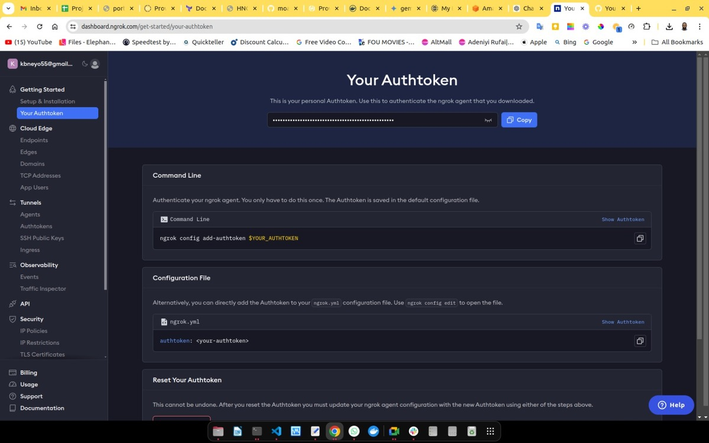

  - Run the following command to authenticate your ngrok client:

    ```bash
    ngrok authtoken <your_ngrok_auth_token>
    ```

  - Replace `<your_ngrok_auth_token>` with the token you copied from the ngrok dashboard.

#### Step 4: Start ngrok

- **Run ngrok to Expose Your Local Server**:
  - Start ngrok to expose your server (running on IP `91.229.239.118` and port `5000`):

    ```bash
    ngrok http 91.229.239.118:5000
    ```

  - This command will create a secure tunnel to your server and provide a public URL.

- **Copy the Forwarding URL**:
  - After running the above command, you will see an output with the forwarding URL.

    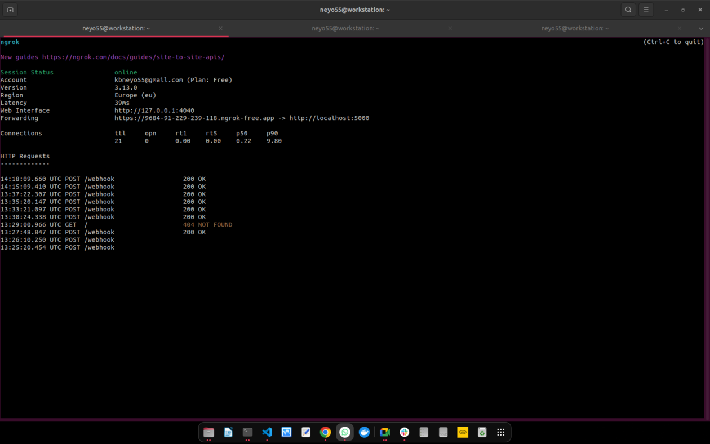

    This image shows the ngrok output after a test triggered by the pull request from a branch called `snake`.

  - Copy the `Forwarding` URL (e.g., `https://9684-91-229-239-118.ngrok-free.app`).

#### Running ngrok in the Background

- **Using `screen`**: A terminal multiplexer tool that allows you to run commands in a virtual terminal that can be detached and run in the background.

  - Install `screen` (if not already installed):

    ```bash
    sudo apt-get install screen
    ```

  - Start a new screen session and run ngrok:

    ```bash
    screen -S ngrok-session
    ```

    ```bash
    ngrok http 91.229.239.118:5000
    ```

  - Detach from the screen session by pressing `Ctrl + A` then `D`.

  - To reattach to the screen session, use:

    ```bash
    screen -r ngrok-session
    ```

---

### Phase 2: GitHub App Setup

#### Step 1: Create a GitHub App

- **Log in to GitHub**:
  - Go to [GitHub](https://github.com/) and log in with your credentials.

- **Navigate to Developer Settings**:
  - Click on your profile picture in the upper-right corner.
  - Select **Settings** from the dropdown menu.
  - Scroll down and find **Developer settings** in the left sidebar.
  - Click on **GitHub Apps** under **Developer settings**.

- **Create a New GitHub App**:
  - Click on the **New GitHub App** button.
  - Fill in the required fields:
    - **GitHub App name**: Choose a name for your app (e.g., `hng-team-4`).
    - **Homepage URL**: Enter your homepage URL or any valid URL (e.g., `https://github.com/neyo55/hng-team-4-github-bot`).
    - **Callback URL**: Enter the callback URL (can be any valid URL for now).
    - **Webhook URL**: Enter the URL or ngrok endpoint where you want to receive webhook events (e.g., `https://9684-91-229-239-118.ngrok-free.app/webhook`).
    - **Webhook secret**: Generate a secret and save it for later use in your `.env` file.

  - **Permissions & Events**:
    - Under **Permissions**, set the required permissions for your app:
      - **Contents**: Read & write
      - **Pull requests**: Read & write

    - Under **Subscribe to events**, select the **Pull request** event.

      This image shows the bot subscribed to the pull request event.

      

      This image shows the bot installed in the GitHub account.

  - **Where can this GitHub App be installed?**: Choose **Only on this account** if you want it limited to your repositories. In this case, it was installed in the docker app repository. **(`neyo55/hng-team-4-docker-app`)**

    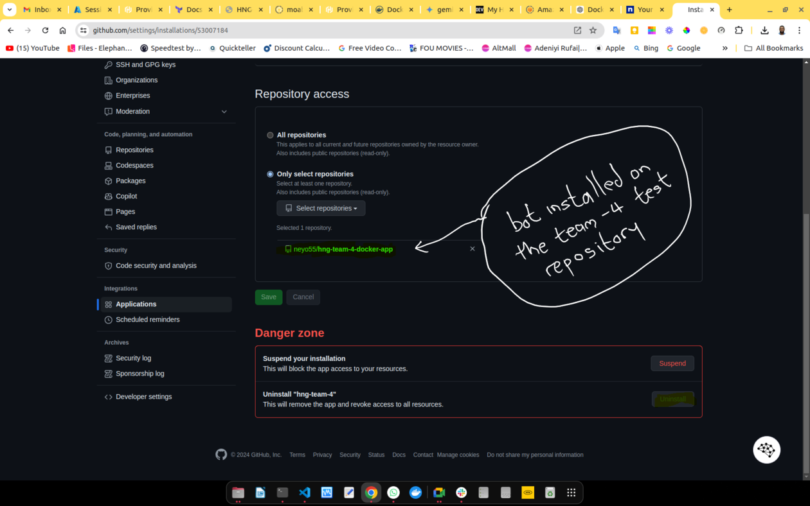

    This image shows the bot installed in the test repository.

- **Create the App**:
  - Click on the **Create GitHub App** button at the bottom.

#### Step 2: Generate a Private Key

- **Generate a Private Key**:
  - After creating the app, you'll be taken to the app's settings page.
  - Scroll down to the **Private keys** section.
  - Click on **Generate a private key**.
  - Download the generated `.pem` file and save it as `private-key.pem` in the `hng-team-4-github-bot` directory.

#### Step 3: Install the GitHub App

- **Install the App**:
  - On the settings page, click on **Install App** on the right side.
  - Choose the account or organization where you want to install the app.
  - Select the repository you want the app to have access to and click **Install**.

#### Step 4: Configure the Bot Application

- **Set Up Environment Variables**:
  - Create a `.env` file in the `hng-team-4-github-bot` directory with the following content:

    ```dotenv
    WEBHOOK_SECRET=<your_github_webhook_secret>
    APP_ID=<your_github_app_id>
    PRIVATE_KEY_PATH=private-key.pem
    ```

  - Replace `<your_github_webhook_secret>` with the webhook secret you generated.
  - Replace `<your_github_app_id>` with the GitHub App ID found on your app's settings page.

- **Create a Virtual Environment for the Application**:
  - Run the following command to create a virtual environment:

    ```bash
    python -m venv venv
    ```

  - Activate the virtual environment:

    ```bash
    source venv/bin/activate
    ```

- **Install Required Python Packages**:
  - Run the following command to install the required packages:

    ```bash
    pip install -r requirements.txt
    ```

- **Run the Flask Application**:
  - Start the Flask application with:

    ```bash
    python app.py
    ```

### Flask Application Features

1. **Environment Configuration**:
   - The application loads configuration values from a `.env` file using `python-dotenv`, allowing sensitive information like `WEBHOOK_SECRET`, `APP_ID`, and `PRIVATE_KEY_PATH` to be managed securely.

2. **Private Key Handling**:
   - Loads a private key from a specified file path for use in JWT token creation, which is crucial for GitHub App authentication.

3. **GitHub Webhook Verification**:
   - **`verify_signature(payload, signature)`**: Verifies incoming GitHub webhook payloads using HMAC with the secret to ensure the request's authenticity.

4. **JWT Token Generation**:
   - **`get_jwt_token()`**: Generates a JSON Web Token (JWT) for authenticating the GitHub App, using the app's private key.

5. **GitHub App Authentication**:
   - **`get_installation_access_token(installation_id)`**: Exchanges the JWT for an installation access token, allowing the app to authenticate as an installation and interact with repositories.

6. **Deployment and Cleanup Automation**:
   - **Deployment**: Automatically deploys a Docker container for a branch when a new pull request is opened.
   - **Cleanup**: Initiates a cleanup script to remove associated Docker containers upon closure of a pull request, ensuring efficient resource usage.

### Scripts in the Project

- **`deploy.sh`**: Executes the deployment process of Docker containers based on a specific branch. The script builds a new Docker container, runs it, and exposes it on a specified port. It also exports the container name and port to a file called `container_info_${BRANCH_NAME}_${PR_NUMBER}_${TIMESTAMP}.txt` for cleanup purposes.

- **`cleanup.sh`**: Responsible for cleaning up Docker containers associated with a specific branch and pull request number. It stops and removes the Docker container and image and deletes any log files.

## Testing and Deployment

1. **Run the Flask App**:
   - Start the Flask app on your server:

     ```bash
     python app.py
     ```

2. **Open a Pull Request**:
   - Open a pull request on your GitHub repository.

   - The bot should deploy the Docker container and post a status update.

    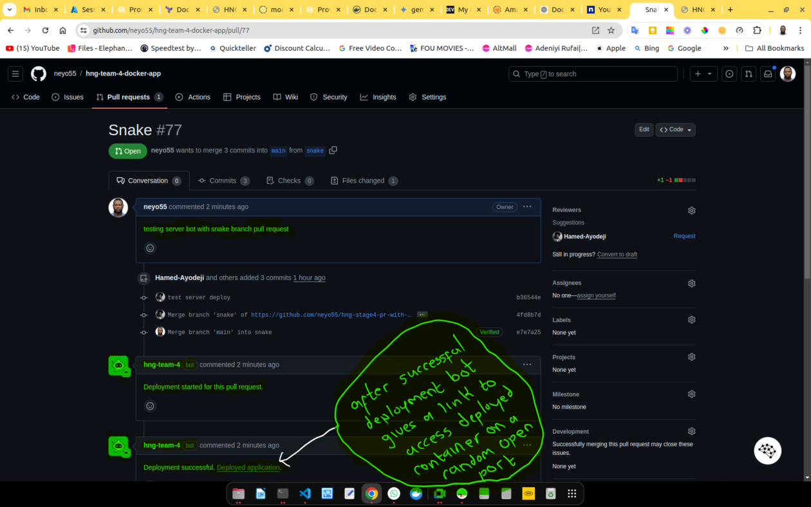

    This image shows a pull request opened from a branch called `snake`.

    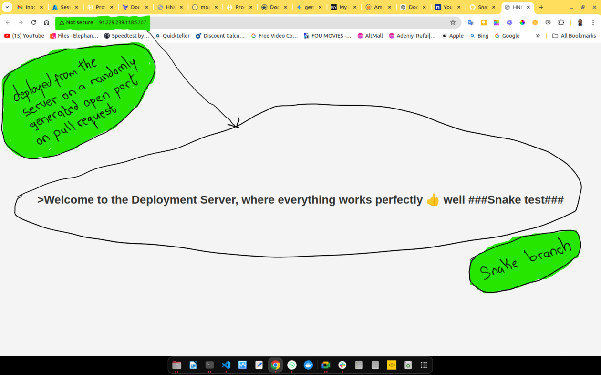

    The link to the bot deployment, as provided after the pull request was opened, is shown here.

    This is compared to the actual content on the main branch, as shown below:

    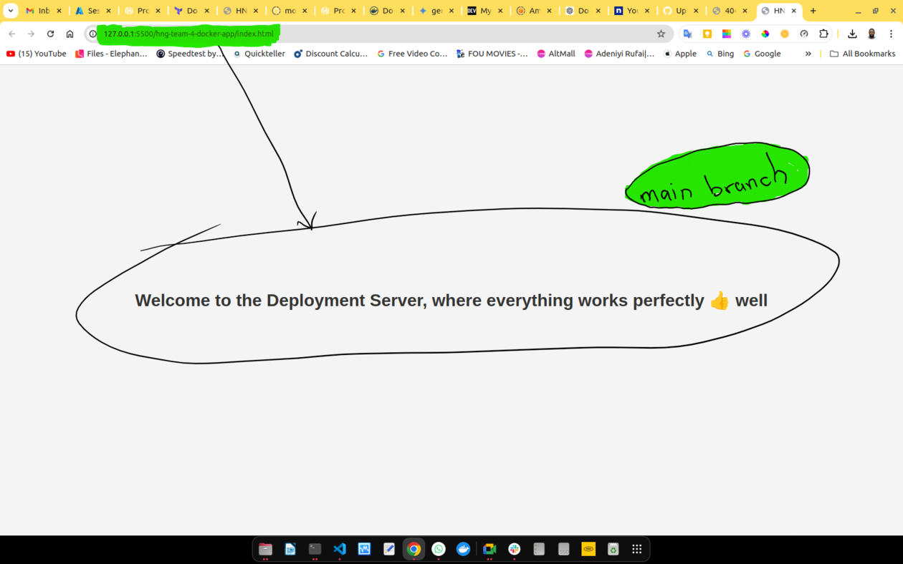

    On the server, the bot deployed the content of the `snake` branch into a Docker container. This image shows the container running on the server after the pull request triggered the bot.

    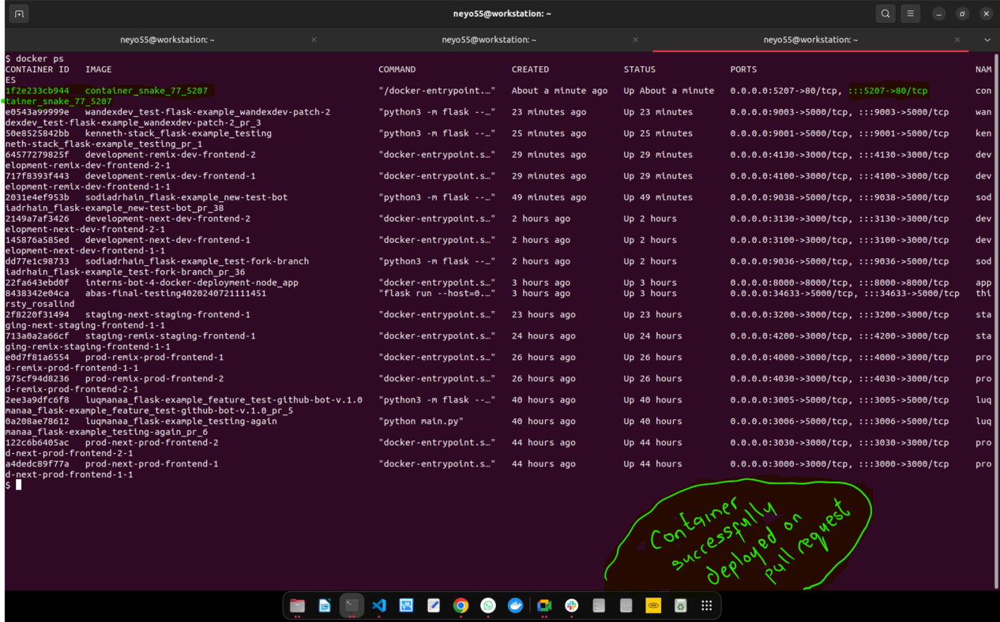

    The bot also created a file that stores the name of the container and the port the container is deployed on, preparing for the cleanup process.

    

3. **Close the Pull Request**:
   - Close the pull request.
   - The bot should clean up the Docker container and post a status update.

   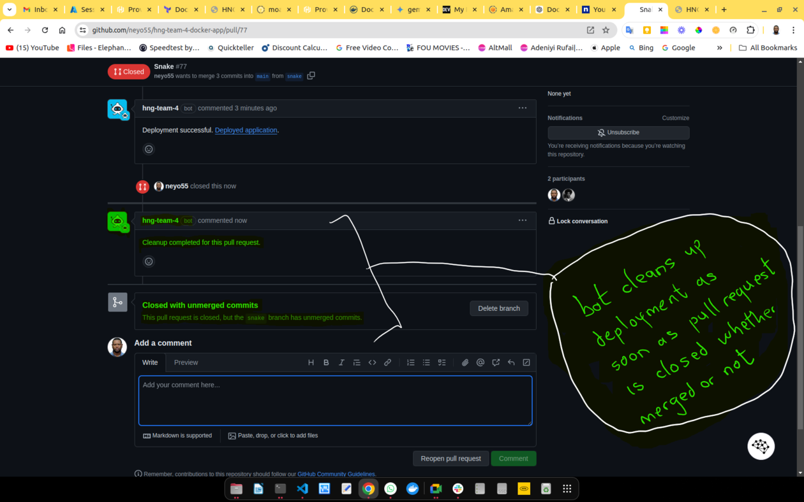

    This image shows the pull request closed and the bot cleaning up the Docker container, notifying that the cleanup was successful.

    To confirm cleanup, run the `docker ps` command on the server. The container that was deployed should be removed.

    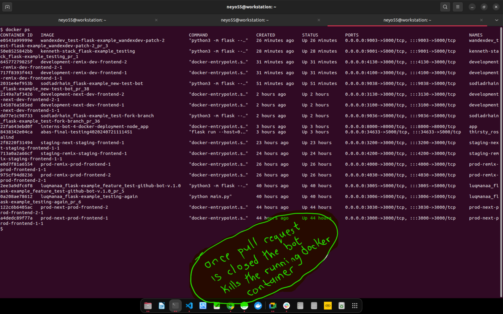

    The bot also deleted the file that stored the name of the container and the port.

    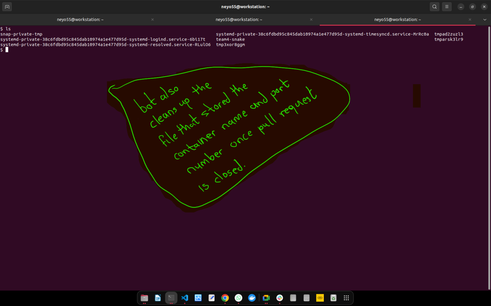

4. **Check the Logs**:
   - Review the Flask app console output for webhook processing logs.

   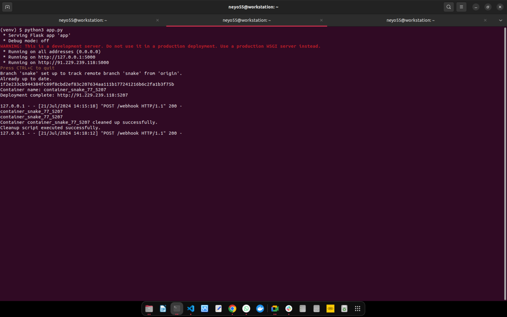

   The logs show webhook processing for the opened and closed pull requests.

## Notes

- **Security**: Ensure your `.env` file and `private-key.pem` are secured and not exposed publicly.
- **Scalability**: Consider using a more robust queueing system like Celery for handling deployment tasks if the load increases.
- **Environment**: Test the bot in a controlled environment before deploying to production.

## References

- [GitHub Apps Documentation](https://docs.github.com/en/developers/apps)
- [Flask Documentation](https://flask.palletsprojects.com/en/2.0.x/)
- [Docker Documentation](https://docs.docker.com/)

## Conclusion

This project demonstrates how to build a GitHub bot using Flask to automate deployment and cleanup processes for Docker containers. By following the setup guide and testing the bot, you can streamline your deployment workflow and enhance collaboration on GitHub repositories.
